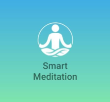
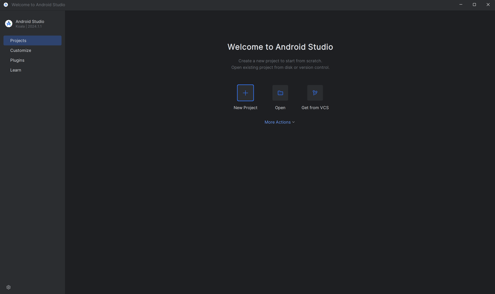
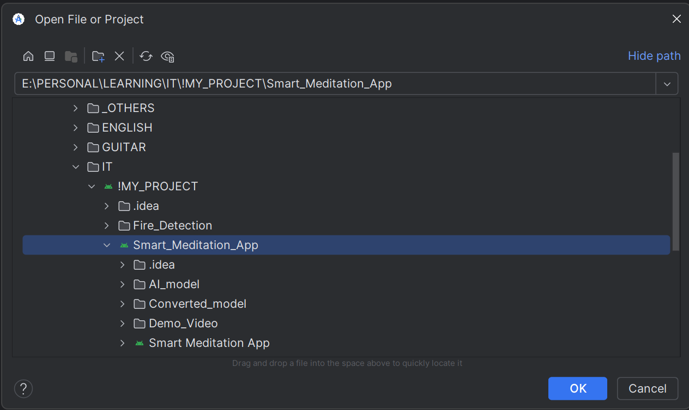

# Smart Meditation App

  <!-- Thay link-to-your-logo-image bằng URL của hình ảnh logo ứng dụng -->

## Mô tả
**Smart Meditation App** là ứng dụng Android tiên tiến giúp theo dõi và hỗ trợ người dùng trong quá trình thiền. 
Ứng dụng sử dụng công nghệ xác minh khuôn mặt và phân tích dáng thiền để đảm bảo người dùng thực hiện đúng kỹ thuật thiền. 
Khi người dùng đáp ứng cả hai điều kiện: khuôn mặt được xác minh và dáng thiền chính xác, đồng hồ thiền sẽ tự động bắt đầu. 
Nếu không, thời gian sẽ dừng lại. 
Dự án này rất hữu ích cho các công ty và đội nhóm tổ chức các sự kiện nhằm nâng cao tinh thần luyện tập thể dục thể thao của nhân viên.

## Công nghệ sử dụng
- **Python**: Phát triển các mô hình AI.
- **Jupyter**: Môi trường để lập trình và thử nghiệm mã.
- **Kotlin**: Ngôn ngữ lập trình chính cho ứng dụng Android.
- **TensorFlow**: Nền tảng máy học để huấn luyện mô hình.
- **ML Kit Face Detection**: Công cụ phát hiện khuôn mặt.
- **Siamese Neural Networks (SNNs)**: Mạng nơ-ron cho xác minh khuôn mặt.
- **MediaPipe**: Thư viện để phát hiện dáng thiền.

## Cấu trúc dự án
Dự án được chia thành 4 phần chính:
1. **Face Verification**: Sử dụng ML Kit Face Detection để phát hiện và cắt khuôn mặt trong Bounding Box cho từng frame. Các ảnh cắt sau đó sẽ được so sánh với ảnh đăng ký của người dùng để xác thực.
  
2. **Meditation Pose Detection**: Thiết lập góc cho tính toán dáng thiền đúng thông qua MediaPipe, với mục tiêu chính là đảm bảo người dùng thực hiện đúng kỹ thuật thiền.

3. **Chuyển đổi model**: Các mô hình được huấn luyện sẽ được chuyển đổi thành định dạng `.tflite` để có thể chạy trên Android Studio.

4. **Phát hành ứng dụng hoàn chỉnh**: Tạo ra bản phát hành cuối cùng cho người dùng.

## Cấu trúc thư mục trong Repo
1. **File `THESIS - Smart Meditation.pdf`**: Báo cáo đầy đủ về dự án.
  
2. **Folder `Demo_App`**: Chứa ảnh và video minh họa cho các tính năng của ứng dụng.

3. **Folder `AI_Model`**: Chứa các model đã được huấn luyện và chuyển đổi sang định dạng `.tflite`.

4. **Folder `Smart Meditation App`**: Toàn bộ mã nguồn để chạy ứng dụng. Bạn có thể tải về và trải nghiệm trên máy ảo hoặc thiết bị Android.

## Hướng dẫn cài đặt
### Bước 1: Clone repository
Clone repository về máy hoặc tải xuống file zip:
```bash
git clone https://github.com/dainsd382/Smart_Meditation_App.git
```

### Bước 2: Mở ứng dụng trong Android Studio
- Mở folder `Smart Meditation App` trong Android Studio (đảm bảo đã cài đặt Android Studio trước khi thực hiện).
- Mở ứng dụng và tiến hành biên dịch.

  <!-- Thay link-to-your-open-image bằng URL của hình ảnh minh họa cho việc mở ứng dụng trong Android Studio -->

### Bước 3: Thiết lập máy ảo hoặc thiết bị Android
- Tạo một máy ảo trên Android Studio hoặc kết nối trực tiếp với thiết bị Android của bạn để trải nghiệm ứng dụng.

  <!-- Thay link-to-your-emulator-image bằng URL của hình ảnh minh họa cho việc thiết lập máy ảo -->

### Liên hệ
Nếu bạn có bất kỳ câu hỏi nào về dự án, hãy liên hệ với chúng tôi qua email: [htdung13052002@gmail.com](mailto:htdung13052002@gmail.com)

### Hướng dẫn thêm hình ảnh
- **Logo**: Thay `link-to-your-logo-image` bằng URL đến hình ảnh logo ứng dụng của bạn.
- **Hình minh họa**: Tương tự, bạn có thể thêm các hình ảnh hướng dẫn cho từng bước cài đặt. Bạn có thể chụp ảnh màn hình các bước và lưu chúng lên một dịch vụ lưu trữ hình ảnh như Imgur hoặc GitHub nếu bạn có repo riêng cho hình ảnh.

Bạn có thể tùy chỉnh nội dung thêm vào theo ý thích. Nếu cần thêm thông tin hay có yêu cầu nào khác, hãy cho mình biết nhé!


